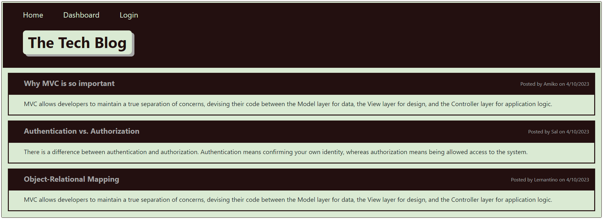

# Tech Blog
## Description
A CMS-style blog built using the Model-View-Controller (MVC) paradigm. This site allows users to  author and publish blog posts, delete their own posts, and comment on other posts.

## Technologies
- bcrypt package to hash passwords
- dotenv for environment variables
- express-session and connect-sequelize for authentication
- Handlebars.js for templating
- Heroku for deployment
- MVC paradigm for the architectural structure
- Sequelize as the ORM

## Installation
Install the required npm packages via CLI by running: 
`npm i bcrypt npm i dotenv npm i express-session npm i connect-sequelize npm i mysql2 npm i express npm i sequelize`

## Deployed Heroku Link
https://mylink.com

## Git repo
https://github.com/whitneywishart/mvc-tech-blog

## Screenshot

